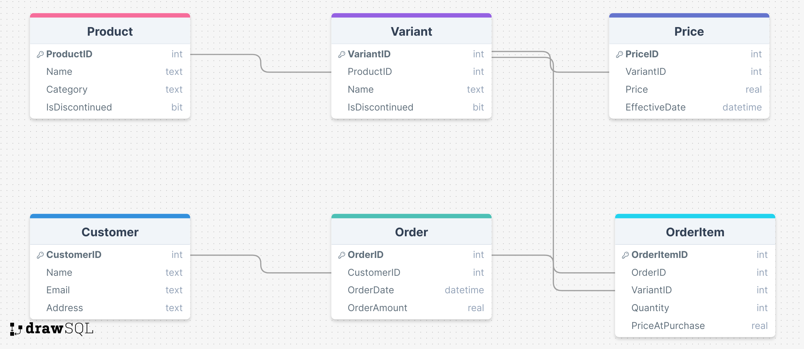

# Problem 1: Data Modelling

### 1. Data Model

**LINK: [LINK to Data Model](https://drawsql.app/teams/vnit-1/diagrams/problem1 "vv")**

**Explaination:**

- The main entities in the schema are Product, Variant, Price, Customer, Order and OrderItem.
- Product-Variant Relationship: The Product table stores general product information, and the Variant table handles different versions of a product. Each product can have multiple variants, establishing a one-to-many relationship between Product and Variant.
- Pricing History: The Price table maintains historical pricing information for each variant. Each variant can have multiple price entries over time, creating a one-to-many relationship between Variant and Price.
- Customer Management: The Customer table contains customer information, ensuring that customer details are stored and managed separately from order information. Each customer can place multiple orders, establishing a one-to-many relationship between Customer and Order.
- Order Tracking: The Order table records individual customer orders, linking each order to a specific customer and capturing the order date. Each order can contain multiple items, creating a one-to-many relationship between Order and OrderItem.
- Order Details: The OrderItem table breaks down each order into its constituent items, detailing the quantity and price of each variant purchased within an order. Each variant can appear in multiple order items, establishing a one-to-many relationship between Variant and OrderItem.
